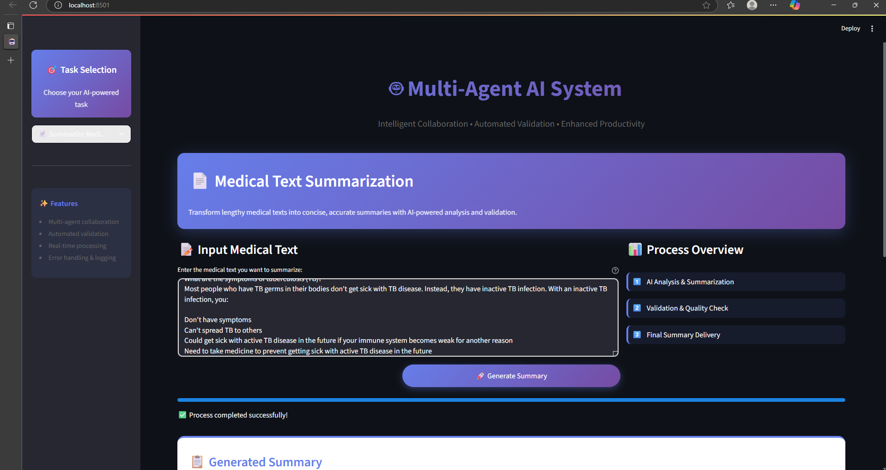
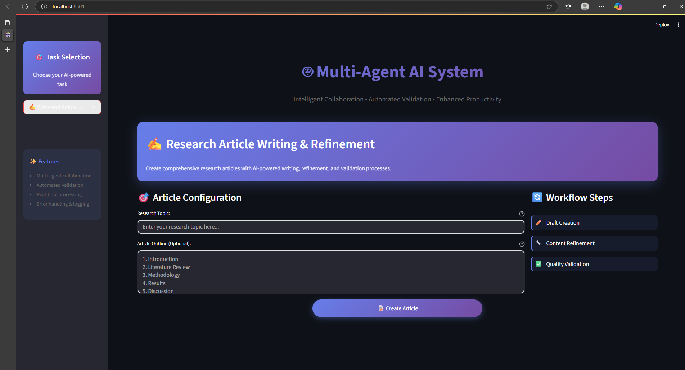

# 🤖 Building AI Agents from Scratch
*A comprehensive guide to creating intelligent agents without frameworks*


## 🎯 Mission Statement

This project demonstrates how to build sophisticated AI agents **completely from scratch** using pure Python and OpenAI's GPT models. No LangChain, no CrewAI, no AutoGen – just clean, understandable code that shows you exactly how AI agents work under the hood.

## 🚀 Why Build from Scratch?

### **Framework Dependency Liberation**
- **No Black Boxes**: Every line of code is yours to understand and modify
- **Full Control**: Complete ownership over agent behavior and decision-making
- **Learning Focus**: Understand the fundamental principles behind AI agents
- **Lightweight**: No heavy dependencies or complex abstractions

### **Educational Value**
- **Core Concepts**: Learn how agents communicate, delegate tasks, and validate outputs
- **Architecture Patterns**: Understand multi-agent orchestration patterns
- **Prompt Engineering**: Master the art of crafting effective agent prompts
- **Error Handling**: Implement robust failure recovery mechanisms

---

## 🏗️ System Architecture

### **The Agent Ecosystem**
```
┌─────────────────────────────────────────────────────────────┐
│                    🌐 Streamlit Interface                   │
└─────────────────┬───────────────────────────────────────────┘
                  │
                  ▼
┌─────────────────────────────────────────────────────────────┐
│                  🧠 Agent Orchestrator                     │
│  • Task routing and coordination                           │
│  • Agent lifecycle management                              │
│  • Communication protocols                                 │
└─────────────────┬───────────────────────────────────────────┘
                  │
        ┌─────────┼─────────┐
        ▼         ▼         ▼
┏━━━━━━━━━━━━━━━━━━━━━━━━━━━━━━━━━━━━━━━━━━━━━━━━━━━━━━━━━━━━━━━━━┓
┃                    🔄 AGENT PAIRS                          ┃
┃                                                            ┃
┃  ┌─────────────────┐    ┌─────────────────┐               ┃
┃  │   📄 Summarizer  │◄──►│   ✅ Validator   │               ┃
┃  │   Medical texts  │    │   Quality check │               ┃
┃  └─────────────────┘    └─────────────────┘               ┃
┃                                                            ┃
┃  ┌─────────────────┐    ┌─────────────────┐               ┃
┃  │  ✍️  Writer      │◄──►│  🔧 Refiner     │               ┃
┃  │  Article drafts │    │  Enhancement    │               ┃
┃  └─────────────────┘    └─────────────────┘               ┃
┃                                                            ┃
┃  ┌─────────────────┐    ┌─────────────────┐               ┃
┃  │  🛡️  Sanitizer   │◄──►│  🔍 Auditor     │               ┃
┃  │  PHI removal    │    │  Privacy check  │               ┃
┃  └─────────────────┘    └─────────────────┘               ┃
┗━━━━━━━━━━━━━━━━━━━━━━━━━━━━━━━━━━━━━━━━━━━━━━━━━━━━━━━━━━━━━━━━━┛
                  │
                  ▼
┌─────────────────────────────────────────────────────────────┐
│                    📊 Logging System                       │
│  • Agent interactions • Task flows • Performance metrics   │
└─────────────────────────────────────────────────────────────┘
```

---

## 🧩 Core Components Deep Dive

### **1. Agent Foundation Classes**
Each agent is built on a common foundation that provides:
- **Prompt Management**: Dynamic prompt construction and templating
- **Context Awareness**: Maintaining conversation state and history
- **Error Recovery**: Graceful handling of API failures and edge cases
- **Response Parsing**: Structured output extraction and validation

### **2. Communication Protocols**
Agents communicate through well-defined protocols:
- **Task Handoffs**: Structured data passing between agents
- **Validation Loops**: Feedback mechanisms for quality assurance
- **Status Reporting**: Real-time progress updates to the orchestrator

### **3. Quality Assurance Pipeline**
Every primary agent has a dedicated validator that:
- **Content Analysis**: Deep semantic understanding of outputs
- **Compliance Checking**: Ensures adherence to domain-specific rules
- **Iterative Improvement**: Provides actionable feedback for refinement

---

## 💡 Agent Specializations

### **🏥 Medical Text Summarizer**
**Purpose**: Transform verbose medical documentation into digestible summaries

**From-Scratch Implementation**:
- Custom medical terminology detection
- Context-aware abbreviation expansion
- Hierarchical information extraction
- Domain-specific quality metrics

**Validation Strategy**:
- Fact preservation verification
- Medical accuracy assessment
- Completeness scoring

### **📝 Research Article Generator**
**Purpose**: Create comprehensive research articles from topics and outlines

**From-Scratch Implementation**:
- Structured content planning
- Section-by-section generation
- Citation formatting
- Academic tone consistency

**Enhancement Pipeline**:
- Content coherence improvement
- Argument strengthening
- Style refinement
- Source integration

### **🔐 Medical Data Sanitizer**
**Purpose**: Remove Protected Health Information (PHI) while preserving analytical value

**From-Scratch Implementation**:
- Custom PHI pattern recognition
- Context-sensitive replacement
- Data utility preservation
- Anonymization strategies

**Privacy Auditing**:
- Residual PHI detection
- False positive analysis
- Anonymization quality scoring

---

## 🛠️ Installation & Setup

### **Quick Start**
```bash
# Clone the repository
git clone https://github.com/AIAnytime/Multi-Agents-System-from-Scratch.git
cd Multi-Agents-System-from-Scratch

# Create isolated environment
python -m venv ai_agents_env
source ai_agents_env/bin/activate  # Windows: ai_agents_env\Scripts\activate

# Install dependencies
pip install -r requirements.txt

# Configure your OpenAI API key
echo "OPENAI_API_KEY=your_key_here" > .env

# Launch the application
streamlit run app.py
```

### **Environment Configuration**
Create a `.env` file with the following variables:
```env
OPENAI_API_KEY=your_openai_api_key
LOG_LEVEL=INFO
MAX_RETRIES=3
TIMEOUT_SECONDS=30
```

---

## 📸 Visual Demonstrations

### **System in Action**
See our AI agents working together to solve real-world problems:

| Demo | Description |
|------|-------------|
|  | **Medical Text Summarization**: Watch as the summarizer agent processes complex medical documents and the validator ensures quality |
|  | **Research Article Generation**: See the writer and refiner agents collaborate to create polished research content |

### **Complete Walkthrough**
🎥 **[Watch the Full Demo Video](https://github.com/Priteshverma123/Multi-Agent-System-without-framework/releases/tag/demo)**

> **Video Details**: Complete system walkthrough showing all agent interactions, validation processes, and real-world use cases. Click the link above to access the demo video from our releases section.

Experience the entire multi-agent workflow in action - from task initiation through validation and final output delivery.

---

## 🎮 Usage Examples

### **Summarizing Medical Reports**
1. Navigate to the "Medical Text Summarizer" tab
2. Paste your medical text (case studies, research papers, clinical notes)
3. Watch the primary agent generate a summary
4. See the validator assess and score the summary quality
5. Download the final summarized output

### **Creating Research Articles**
1. Go to the "Research Article Writer" tab
2. Enter your research topic and optional outline
3. The writer agent creates an initial draft
4. The refiner agent enhances structure and clarity
5. Export your polished research article

### **Sanitizing Sensitive Data**
1. Access the "Data Sanitizer" tab
2. Upload or paste medical data containing PHI
3. The sanitizer removes sensitive information
4. The auditor verifies complete PHI removal
5. Download your privacy-compliant dataset

---

## 📊 Monitoring & Analytics

### **Real-Time Logging**
- **Agent Performance**: Response times, success rates, error frequencies
- **Quality Metrics**: Validation scores, improvement suggestions
- **System Health**: API usage, resource consumption, uptime statistics

### **Log Analysis**
Logs are structured for easy analysis:
```
logs/
├── agent_interactions.log    # Agent-to-agent communications
├── task_execution.log       # Task processing details
├── validation_results.log   # Quality assessment outcomes
└── system_performance.log   # Performance metrics
```

---

## 🔧 Customization Guide

### **Adding New Agent Types**
1. Extend the base `Agent` class
2. Implement task-specific prompt templates
3. Define validation criteria
4. Register with the orchestrator

### **Modifying Agent Behavior**
- **Prompt Engineering**: Adjust agent instructions and examples
- **Validation Rules**: Customize quality assessment criteria
- **Error Handling**: Implement domain-specific recovery strategies

### **Scaling Considerations**
- **Parallel Processing**: Enable concurrent agent execution
- **Resource Management**: Implement intelligent rate limiting
- **Performance Optimization**: Cache frequently used prompts

---

## 🤝 Contributing to the Project

We welcome contributions that advance the "from scratch" philosophy:

### **Contribution Guidelines**
- **No Framework Dependencies**: Keep the codebase framework-free
- **Educational Focus**: Prioritize code clarity over clever abstractions
- **Documentation**: Explain the "why" behind implementation decisions
- **Testing**: Include unit tests for new agent capabilities

### **Development Workflow**
```bash
# Fork and clone your fork
git clone https://github.com/Priteshverma123/Multi-Agent-System-without-framework.git

# Create feature branch
git checkout -b feature/new-agent-type

# Implement your changes
# Add tests and documentation

# Submit pull request
git push origin feature/new-agent-type
```

---

## 📚 Learning Resources

### **Understanding Agent Architecture**
- Study the `agents/` directory for implementation patterns
- Review `orchestrator.py` for coordination logic
- Examine prompt templates in `prompts/` for agent instructions

### **Advanced Topics**
- **Multi-turn Conversations**: Implementing stateful agent interactions
- **Dynamic Prompting**: Adaptive prompt generation based on context
- **Performance Optimization**: Efficient API usage and response caching

---

## 🏆 Project Goals Achieved

✅ **Zero Framework Dependencies**: Pure Python implementation  
✅ **Educational Transparency**: Every component is understandable  
✅ **Production Ready**: Robust error handling and logging  
✅ **Extensible Design**: Easy to add new agent types  
✅ **Quality Assurance**: Built-in validation for all outputs  
✅ **Real-world Applications**: Practical medical text processing  

---

## 📄 License & Attribution

This project is licensed under the MIT License. See [LICENSE](LICENSE) for details.

### **Acknowledgments**
- **OpenAI** for GPT model access and API
- **Streamlit** for the intuitive web interface framework
- **Loguru** for comprehensive logging capabilities
- The AI community for inspiration and best practices

---

**Built with ❤️ for developers who want to understand AI agents from the ground up**